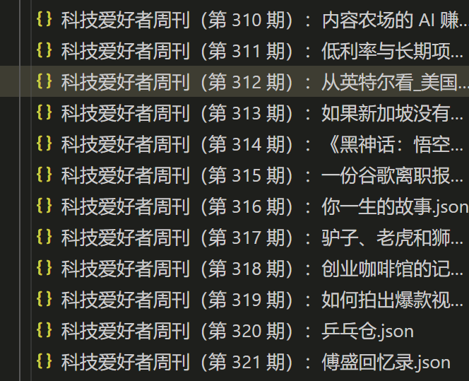
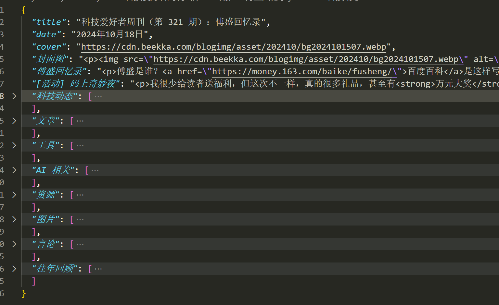

## 简介

这是一个自定义仓库，因为非常喜欢阮一峰老师的周刊，想针对周刊的内容进行学习研究，想要针对专题进行整理成图片集、言论集，但是 markdown 或者 html 格式操作不方便。所以，写了个小工具实现将阮一峰科技爱好者周刊的内容转为标准化 json 格式。

## 快速上手

1. `pnmp i`
2. 在 vscode 中 执行 `2.获取阮一峰周刊 html，然后转为 json.js`
3. 生成 json 文件在 `weekly` 中。

## 预览效果

## 补充

一开始是想通过 markdown 去做解析和格式化，但是发现 markdown 解析起来很麻烦，还不如直接获取 html 然后进行解析。

不过在找的过程中，发现了一个很好的项目，是 plantree 的 [ruanyf-weekly](https://github.com/plantree/ruanyf-weekly)，部署在 plantree 的网站上，可以在线阅读，美观大气，符合我的审美，顺便学习了一下 sh 的脚本获取文件处理文件。

## 致谢

- [阮一峰老师](https://www.ruanyifeng.com/blog/weekly/)
- [plantree](https://github.com/plantree/ruanyf-weekly)
